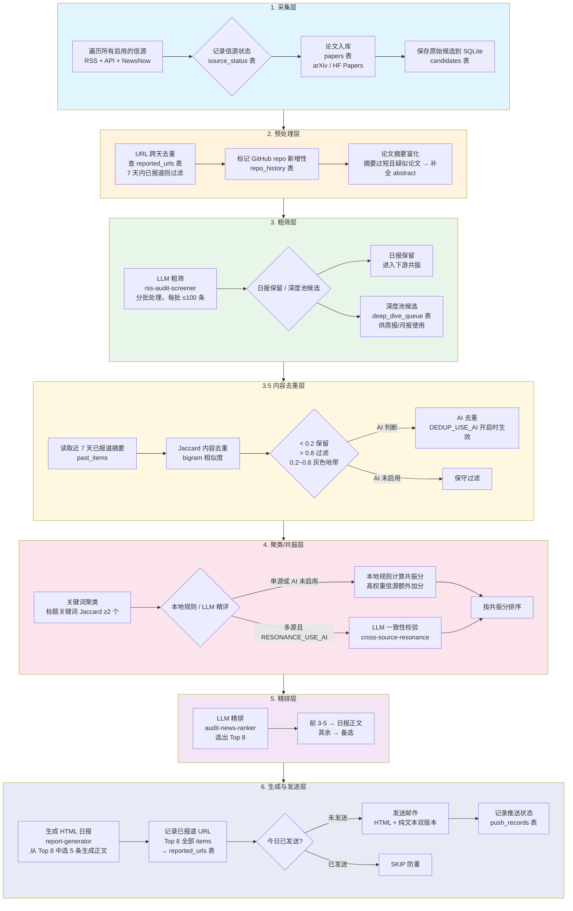
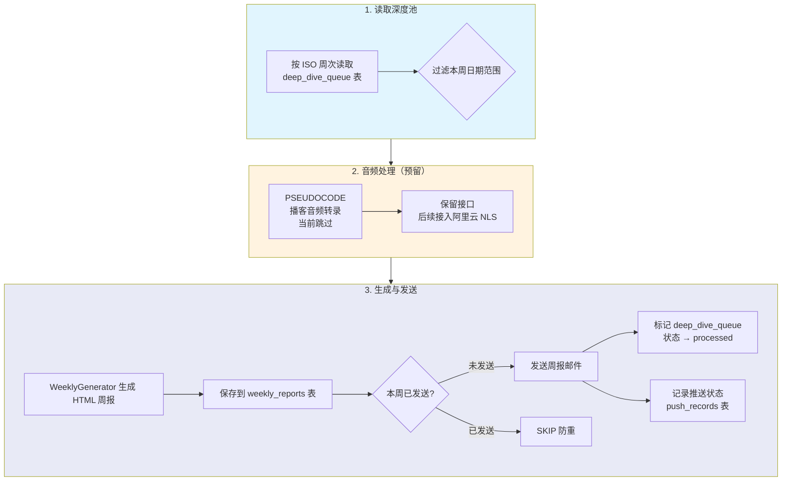
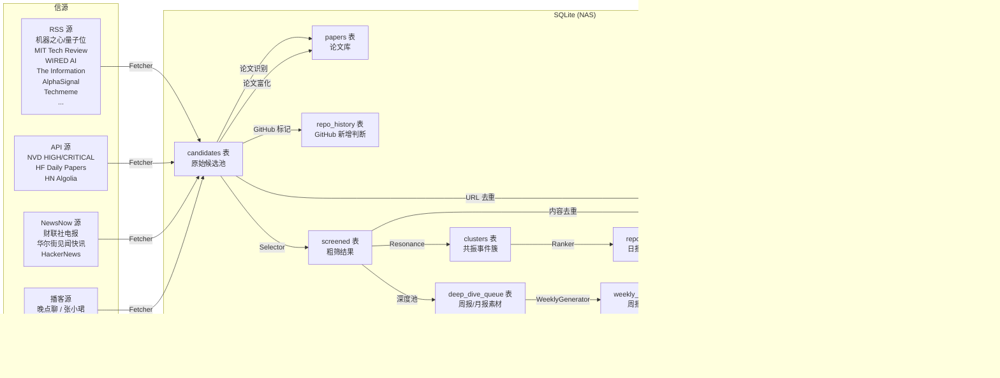

# 当前 Audit Radar 处理流程

## 日报流水线（`index.py`）

> **LLM Skill 索引**：粗筛 `rss-audit-screener` → 共振精评 `cross-source-resonance` → 精排 `audit-news-ranker` → 生成 `report-generator`。详见下文「[LLM Skill 体系](#llm-skill-体系)」。



## 周报流水线（`weekly.py`）



## 关键数据流向



## 去重机制详解

日报流水线中包含**两级去重**，时机和目的各不相同：

| 阶段 | 触发时机 | 机制 | 对比对象 | 目的 |
|------|----------|------|----------|------|
| **URL 去重** | 采集后、粗筛前 | URL hash 精确匹配 | `reported_urls` 表（近 7 天） | 过滤**完全相同的链接**已被报道过的新闻 |
| **内容去重** | 粗筛后、共振前 | Jaccard bigram + 可选 AI 判断 | `reported_urls` 近 7 天摘要 | 过滤**不同链接但内容相同/相似**的新闻 |

### Jaccard 内容去重阈值策略

```
Jaccard < 0.2  → 直接保留
Jaccard > 0.8  → 直接过滤
0.2 ~ 0.8      → 灰色地带
                 ├─ DEDUP_USE_AI=true  → 调用 LLM 判断 is_duplicate
                 └─ DEDUP_USE_AI=false → 保守过滤（默认行为）
```

## 去重 vs 记录已报道 URL

| 阶段 | 操作 | 目的 | 存储 |
|------|------|------|------|
| **采集后** | `dedup_pipeline` 查 `reported_urls` | 过滤明天会重复的内容 | 读取 |
| **精排后** | `save_reported_urls` 写入全部 Top 8 的 items | 记录今天推送了什么，为明天去重提供历史数据 | 写入 `reported_urls` |

> 两者不是同一个东西：去重是**读取**历史数据做过滤；记录已报道是**写入**今天的结果，为明天去重提供历史数据。

## 关键配置项

| 配置 | 环境变量 | 默认值 | 说明 |
|------|----------|--------|------|
| URL 去重窗口 | — | 7 天 | 硬编码于 `index.py` |
| 内容去重窗口 | — | 7 天 | 硬编码于 `index.py` |
| AI 去重开关 | `DEDUP_USE_AI` | `false` | 灰色地带是否启用 LLM 判断 |
| 共振 AI 开关 | `RESONANCE_USE_AI` | — | 多源 cluster 是否启用 LLM 精评 |
| 粗筛批次大小 | — | 100 | 硬编码于 `selector.py` |
| 精排输出数量 | — | Top 8 | 硬编码于 `ranker.py`，前 3-5 生成日报 |
| RSS 单源上限 | `RSS_MAX_ITEMS` | 20 | 每个 RSS 源最多抓取条数 |
| NVD 单页数量 | `NVD_RESULTS_PER_PAGE` | 10 | NVD API 每页返回条数 |

## 信源类型与周期

| 类型 | 数量 | 代表信源 | 默认 report_cycle |
|------|------|----------|-------------------|
| RSS | 17+ | 机器之心、MIT Tech Review、WIRED AI 等 | `daily` |
| API | 3 | NVD、HF Papers、HN Algolia | `daily` |
| NewsNow | 3 | 财联社电报、华尔街见闻、HackerNews | `daily` |
| 播客 | 3 | 晚点聊、张小珺、厚雪长波 | `weekly` |

> 播客源（`content_type: podcast`）默认进入 `weekly` 周期，经粗筛后落入 `deep_dive_queue`，供周报生成使用。

---

## LLM Skill 体系

Audit Radar 的日报流水线中嵌入 **4 个 LLM Skill**，按执行顺序依次为：`rss-audit-screener` → `cross-source-resonance`（可选） → `audit-news-ranker` → `report-generator`。Skill 定义文件位于 `skills/<skill-name>/SKILL.md`，运行时通过 `core.skill_loader.load_skill_prompt()` 加载 system prompt。

| # | Skill 名称 | 流程阶段 | 代码入口 | 模型默认 | 触发条件 |
|---|-----------|---------|---------|---------|---------|
| 1 | `rss-audit-screener` | Phase 3 粗筛 | `core.selector:Selector.screen` | `MODEL_SCREEN` fallback `MODEL_NAME` | 每日必执行 |
| 2 | `cross-source-resonance` | Phase 4 共振精评 | `core.resonance:ResonanceDetector._llm_score_cluster` | `MODEL_NAME`（当前硬编码走百炼 API） | 多源 cluster 且 `RESONANCE_USE_AI=true` |
| 3 | `audit-news-ranker` | Phase 5 精排 | `core.ranker:Ranker.rank` | `MODEL_RANK` fallback `MODEL_NAME` | 每日必执行 |
| 4 | `report-generator` | Phase 6 生成 | `core.generator:Generator.generate` | `MODEL_GENERATE` fallback `MODEL_NAME` | 每日必执行 |

---

### 1. rss-audit-screener（粗筛器）

**定位**：AI 行业情报编辑。从噪音中识别对 AI 从业者有价值的信号。

**输入**：候选新闻列表（分批处理，每批 ≤100 条），字段包括 `title`、`source`、`summary`、`link`、`report_cycle`、`content_type`、`audio_url`、`hn_score`、`stars`、`categories`。

**输出**：JSON 数组，每条包含：
- `keep`: `strong` / `yes` / `no`
- `deep_dive_candidate`: `true` / `false`（仅 `weekly`/`monthly` 源触发）
- `total_score`: 五维总分
- `dimension_scores`: `{A, B, C, D, E}`
- `category`: `tech` / `security` / `business` / `infra` / `regulatory`
- `reason`, `industry_mapping`

**核心决策逻辑**：

| 规则 | 说明 |
|------|------|
| **P0 必留** | 重大安全事件 / 重大产品发布 / 重大商业变动 / 开源里程碑 / 监管新规 / 基础设施重大事件 → 直接 `strong keep`，无需打分 |
| **五维评分** | A 行业影响力(30%) + B 技术突破性(25%) + C 信源质量(20%) + D 社区热度(15%) + E 时效性(10%) |
| **保留阈值** | 总分 ≥ 25 且至少一维 ≥ 8 分 → `keep: yes` |
| **深度池判定** | 对 `weekly`/`monthly` 源（播客/长文）额外判断 `deep_dive_candidate`，落入 `deep_dive_queue` |
| **特殊信源规则** | AlphaSignal 的 `security`/`open source` 类别优先；GitHub repo 新增且 star ≥10k 大幅提前；arXiv 默认拒绝除非被媒体报道 |

**与下游衔接**：`keep: strong/yes` 的进入日报流程，`deep_dive_candidate: true` 的写入 `deep_dive_queue` 供周报使用。

---

### 2. cross-source-resonance（共振检测器）

**定位**：情报验证分析师。判断同一事件是否被足够多的**独立信源**证实。单源消息可能是噪音，多源共振才是真实信号。

**输入**：单个事件簇（`cluster`），包含 `event_title`、`items[]`（多条相关新闻）、`sources[]`、`categories[]`。

**输出**：JSON，包含：
- `resonance_score`: 加权共振分
- `level`: `high` / `medium` / `low` / `none`
- `consistency_check`: `pass` / `fail`
- `consistency_note`: 一致性说明
- `recommendation`: 入选建议

**核心评分体系**：

| 维度 | 计算方式 |
|------|---------|
| 信源独立性 | 每增加 1 个独立信源 +10 分；同机构不同栏目不独立 |
| 信源质量加权 | 官方公告 ×2.0、权威财经媒体 ×1.5、技术社区 ×1.2、自媒体 ×0.5、社交媒体 ×0.3 |
| 内容一致性 | 关键事实矛盾扣 15 分；互相补充加 10 分 |
| 时效一致性 | 相近时间窗口（24h 内）加 5 分；旧闻跟进减 5 分 |

**共振阈值**：

| 等级 | 分数 | 判定 |
|------|------|------|
| 高共振 | ≥ 40 | 真实信号，几乎必报 |
| 中共振 | 20~39 | 可信信号，值得报道 |
| 低共振 | 10~19 | 单一信源，谨慎报道 |
| 无共振 | < 10 | 可能噪音，不入选 |

**特殊规则**：监管机构官方公告即使只有 1 个信源，也视为高共振（官方本身就是权威）。

**与上下游衔接**：仅对**多源 cluster**（`len(sources) >= 2`）且 `RESONANCE_USE_AI=true` 时启用；否则回退本地规则打分。输出结果写回 `cluster` 对象的 `resonance_score`、`level`、`consistency_check` 等字段。

---

### 3. audit-news-ranker（精排器）

**定位**：AI 行业情报主编。在已保留的新闻中，按行业重要性和信息质量排序，选出最值得报道的条目。

**输入**：共振后的事件簇列表（`clusters`），每个簇包含 `event_title`、`sources[]`、`categories[]`、`resonance_score`、`level`。

**输出**：JSON，包含：
- `selected_indices`: 选中的索引数组（0-based，共 8 个，按优先级排序）
- `reasons`: 每条入选理由（与 `selected_indices` 一一对应）
- `summary`: Top 8 主题分布的一句话总结

**排序维度（优先级降序）**：

| 优先级 | 维度 | 说明 |
|--------|------|------|
| 0 | **安全事件（硬性约束）** | CVE / 安全事件 / 数据泄露 / 模型安全事件**必须入选**，至少 1 条 |
| 1 | **监管动态与行业合规** | 政府政策、出口管制、数据安全审查 → 大幅提前 |
| 2 | **行业影响力** | 顶级 AI 公司核心动态 > 知名 AI 公司 > 小公司产品 |
| 3 | **技术突破性** | 新范式/新架构/新工具链 > 渐进改进 |
| 4 | **信息稀缺性/独家性** | 付费媒体独家 > 公开报道 > 二手解读 |
| 5 | **社区热度** | HN 100+ / star 日增 5000+ → 重要参考（非决定性） |
| 6 | **时效性** | 今日首次披露 > 48h 内 > 本周 |

**特殊规则**：
- `is_new_repo=true` 且 star ≥10k 且涉及安全/agent/基础设施 → 排名大幅提前
- 候选不足 8 个时，有多少选多少
- 独家信源单源消息：权威付费媒体可保留，标注"独家信源，尚未形成多源共振"

**与下游衔接**：`selected_indices` 传递给 `report-generator`，由生成器从中选 3-5 条生成日报正文，其余作为备选。全部 8 个的 items 写入 `reported_urls` 表。

---

### 4. report-generator（日报生成器）

**定位**：AI 行业情报写手。从 8 条素材中选出 3-5 条，转化为结构化情报专报 HTML。

**输入**：`selected_indices`（8 个索引） + `clusters`（完整事件簇列表）。

**输出**：纯 HTML 字符串（不包裹 markdown 代码块）。

**核心生成规则**：

| 规则 | 说明 |
|------|------|
| **从 8 选 3-5** | 按叙事完整性、主题多样性、安全/监管优先、信息密度选出 3-5 条 |
| **叙事模式 80/20** | 80% 平铺直叙（直接陈述事实）；20% 深层逻辑（仅在安全/治理/商业模式/范式转移时触发 `insight-box`） |
| **审计视角** | 最多 1~2 条，对 IT 审计/合规有警示意义时生成 `audit-box`，不硬凑 |
| **去掉量化信号** | ❌ 不出现 HN 分数、GitHub star 数等社区指标；✅ 可提及具体技术参数（如"降本 70%"）作为事实陈述 |
| **跨源整合** | 多个信源报道同一主题的不同侧面 → 整合成一个叙事块，不是并列多条 |
| **不输出 URL** | 正文中不出现 `<a>` 标签或裸露 URL，来源用纯文本（如"来源：Techmeme 聚合，Bloomberg 首发"） |
| **标题中文为主** | 公司名/产品名/技术名保留英文，标题和正文主体用中文 |
| **字数控制** | 每条故事 300~600 字（含可选 insight-box 和 audit-box） |

**HTML 结构**：`header`（标题+日期）→ `story` × 3-5（标题 + meta + 正文 + 可选 insight-box + 可选 audit-box）→ `footer`。CSS 内联在 `<style>` 中，不依赖外部样式表。

**与下游衔接**：HTML 输出直接传递给 `Sender.send()` 发送邮件，同时保存到 `reports` 表。

---

### Skill Prompt 加载机制

```python
# core/skill_loader.py 伪代码
def load_skill_prompt(skill_name: str) -> str:
    """加载 skill 的 system prompt。"""
    path = f"skills/{skill_name}/SKILL.md"
    # 解析 YAML frontmatter，提取 system prompt（SKILL.md 中 # 角色定位 之后的内容）
    return system_prompt_text
```

运行时：
1. `Selector.screen()` 加载 `rss-audit-screener` 的 system prompt + 格式化后的候选列表 → 调用 LLM
2. `ResonanceDetector._llm_score_cluster()` 加载 `cross-source-resonance` 的 system prompt + 格式化后的事件簇 → 调用百炼 API
3. `Ranker.rank()` 加载 `audit-news-ranker` 的 system prompt + 格式化后的候选列表 → 调用 LLM
4. `Generator.generate()` 加载 `report-generator` 的 system prompt + JSON 化的素材 → 调用 LLM

所有 LLM 调用统一走 `core.llm_client.chat_completion()`，支持 DeepSeek / Moonshot / 百炼 多供应商切换，通过 `config.MODEL_*` 环境变量控制模型路由。
