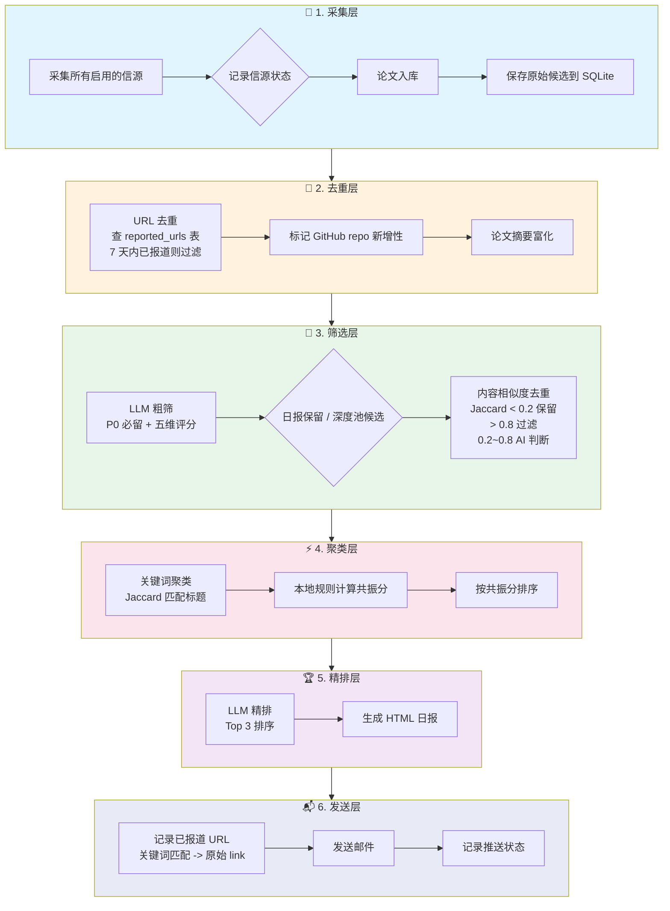
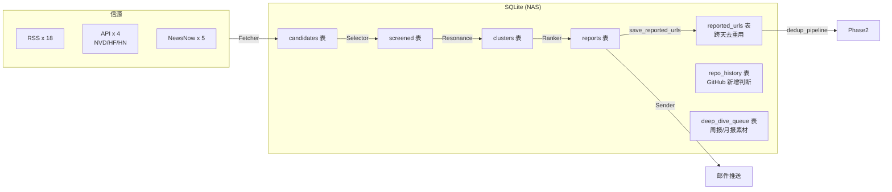

# 当前 Audit Radar 处理流程

## 关键数据流向

## 去重 vs 记录已报道 URL

| 阶段 | 操作 | 目的 | 存储 |
|------|------|------|------|
| **采集后** | `dedup_pipeline` 查 `reported_urls` | 过滤明天会重复的内容 | 读取 |
| **精排后** | `_find_cluster_by_title` 提取原始 link | 记录今天推送了什么 | 写入 `reported_urls` |

> 两者不是同一个东西：去重是**读取**历史数据做过滤；记录已报道是**写入**今天的结果，为明天去重提供历史数据。
