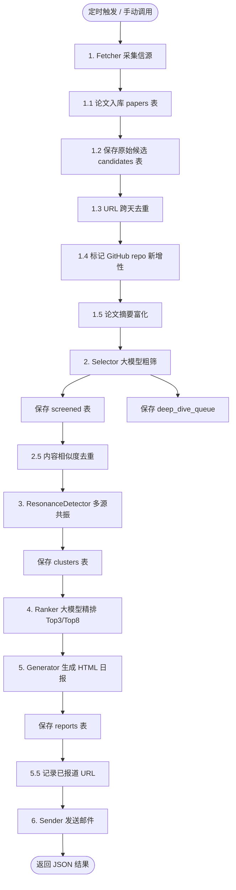
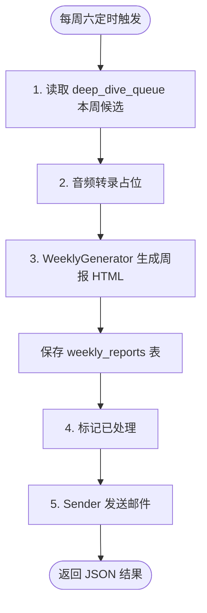
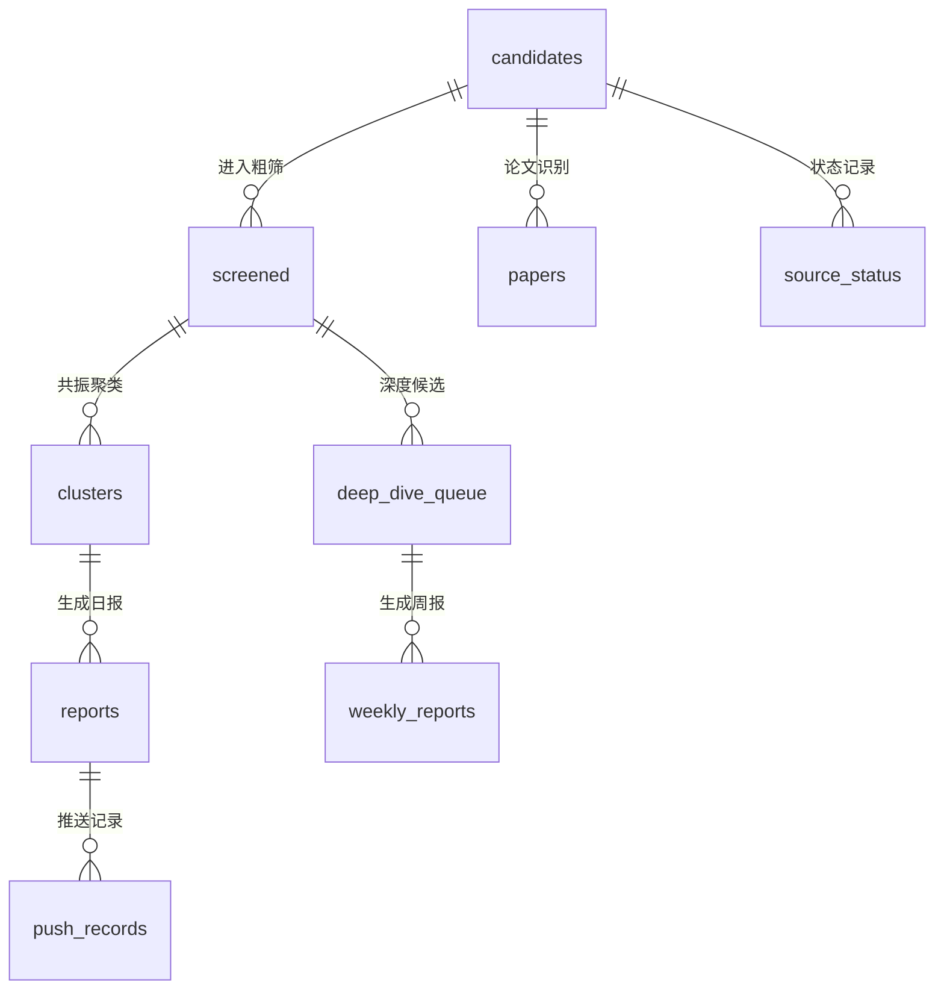

# Audit Radar 流程图

## 1. 日报流程 (index.handler)

## 2. 周报流程 (weekly.handler)

## 3. 数据表关系

## 4. 去重分层

1. **URL 去重**：MD5(link) 与 `reported_urls` 比对，7 天窗口
2. **Jaccard 去重**：summary 分词相似度 >= 0.85 视为重复
3. **AI 批量去重**：`DEDUP_USE_AI=true` 时启用，处理 0.3~0.85 模糊区间

## 5. 环境变量控制

| 变量 | 作用 |
|------|------|
| `DASHSCOPE_API_KEY` | 百炼 API 密钥 |
| `MODEL_NAME` | 默认 `deepseek-v4-flash` |
| `AUDIT_DB_PATH` | 本地 `data/audit.db`，FC 生产 `/mnt/audit-radar/data/audit.db` |
| `DEDUP_USE_AI` | 是否启用 AI 批量去重 |
| `RESONANCE_USE_AI` | 是否启用 LLM 共振评分 |
| `MAIL_*` | 邮件发送配置 |
